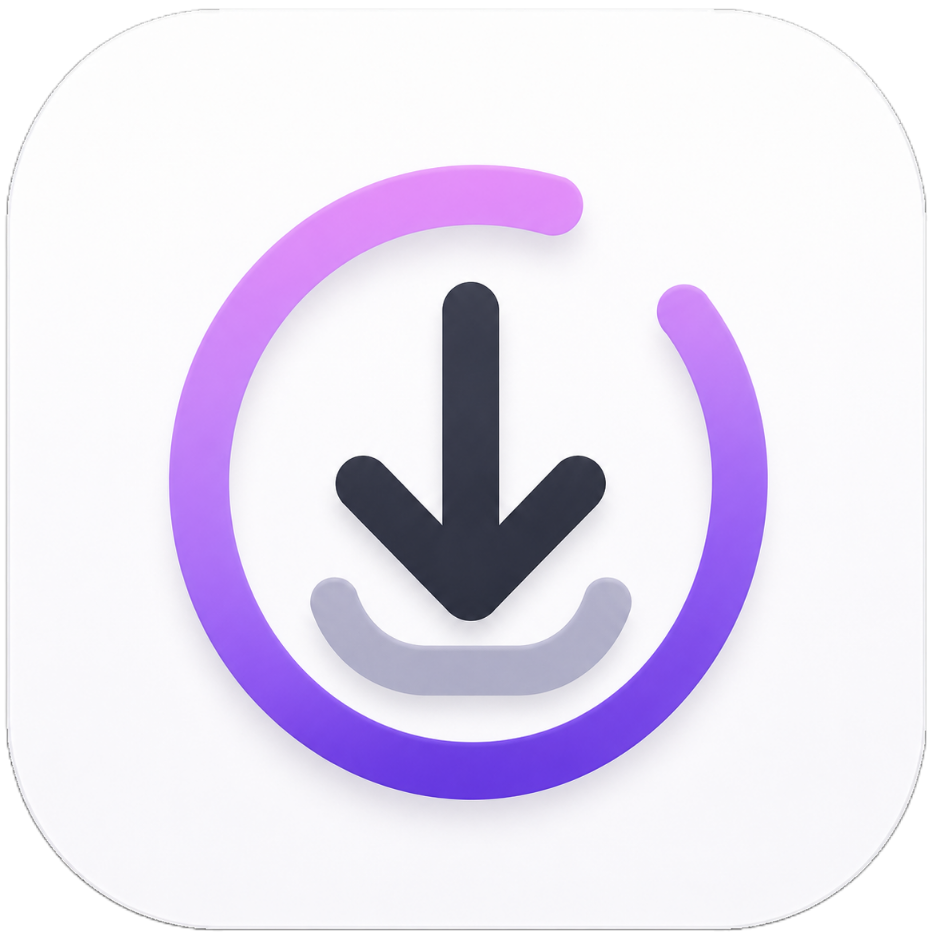

<div align="center">
  
  <h1>Downloda</h1>
  <p>A minimal, background-first media downloader and converter for Android</p>
</div>

---

## Overview

Downloda is a modern, premium Android application designed to facilitate robust, offline-first media downloads and format conversions. Utilizing a modular, event-driven architecture, Downloda executes background downloading processes seamlessly, merges high-definition video and audio streams, and provides an elegant, responsive user interface designed with micro-animations and custom glassmorphism components.

---

## Technical Stack

| Category | Technology | Purpose |
| :--- | :--- | :--- |
| **Framework** | Flutter (Dart SDK) | Cross-platform runtime and UI rendering |
| **State Management** | Flutter Riverpod | Declarative dependency injection and reactive state caching |
| **Local Database** | Drift (SQLite) | Reactive relational storage with WAL journal mode |
| **Background Processing**| WorkManager & Services | Persistent background workers and data sync foreground services |
| **Media Processing** | FFmpeg (ffmpeg_kit_flutter) | Local high-definition stream merging (DASH muxing) and audio encoding |
| **Platform Channels** | Kotlin / JNI | Media scanning, dynamic app icon aliases, and system notification links |

---

## System Architecture

Downloda is structured to isolate business logic, local data persistency, and platform-specific native systems:

```
lib/
├── core/
│   ├── database/          # Drift database schema, tables, and reactive queries
│   ├── services/          # FFmpeg conversions, foreground downloads, and notification management
│   ├── providers.dart     # Riverpod state injection context
│   ├── models.dart        # Platform enum declarations and immutable domain models
│   └── theme.dart         # Custom light and dark color schemes, gradients, and text styles
├── features/
│   ├── downloads/         # Active download queue, progress trackers, and URL input sheet
│   ├── history/           # Local download logs and finished file directory cards
│   ├── player/            # Fullscreen native video playback viewport
│   ├── whatsapp/          # Document and status scraper dashboard
│   ├── settings/          # Custom theme swapper, download quality presets, and app icon alias controller
│   └── onboarding/        # Initial app workflow walkthrough views
└── main.dart              # Multi-isolate background registers and application entry point
```

---

## Key Features

### Persistent Background Downloading
* Executes background download threads using Workmanager and Native Foreground Services (`ShareForegroundService`).
* Implements robust resume logic and connection state listeners (`connectivity_plus`) to automatically pause and resume queues when WiFi changes.

### Local Stream Merging & Conversions
* Downloads high-quality video-only and audio-only streams separately (DASH protocol) and merges them into a single high-definition file locally.
* Uses local FFmpeg compilation to encode videos directly into high-fidelity audio formats (e.g., MP3) offline.

### Reactive Persistence
* SQLite database backed by Drift provides a robust, real-time relational storage engine.
* Runs SQLite with Write-Ahead Logging (WAL) enabled, allowing safe parallel reads and writes across background download isolates and foreground UI threads.

---

## Compilation and Distribution

### Prerequisites
* Flutter SDK (3.11.5 or newer)
* Android NDK (Version compatible with Gradle build tools)
* JDK 17

### Architecture Splitting
To avoid shipping a massive single binary containing native FFmpeg libraries for all target architectures, the application is compiled into split APKs. Each APK contains only the native binaries for its target architecture, resulting in a dramatic size reduction of up to 70%.

To compile the release binaries, execute:

```bash
flutter build apk --release --split-per-abi
```

This compiles three highly optimized production binaries inside `build/app/outputs/flutter-apk/`:

1. **`app-arm64-v8a-release.apk`**: Target for modern 64-bit ARM devices (75.0 MB).
2. **`app-armeabi-v7a-release.apk`**: Target for older 32-bit ARM devices (110.6 MB).
3. **`app-x86_64-release.apk`**: Target for emulators and x86_64 tablets (83.0 MB).

To compile an Android App Bundle for publication to the Google Play Store:

```bash
flutter build appbundle --release
```
